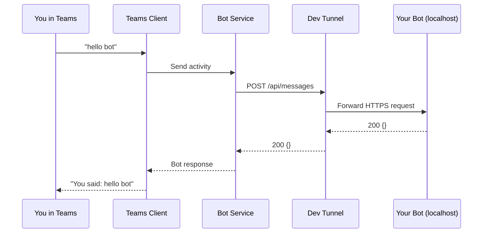

# Getting Started

Let’s get your first Teams bot replying fast.

1. Have access to a Teams tenant, with your [app sideloaded](https://learn.microsoft.com/microsoftteams/platform/concepts/deploy-and-publish/apps-upload) and a tunnel pointing to your localhost ([setup checklist](#step-1-setup-check-30-seconds), [details](#setup-details-if-you-need-them)).
2. Be ready in ~5 seconds in any language.
3. Talk to your bot in Teams.

::: tip
Yes, there’s a little setup first. Think of it as the “stretching before sprinting” part — less fun than chatting with your bot, but better than pulling a hamstring in production.
:::

---

## Step 1 — Setup check (30 seconds)

- ✅ Teams tenant access
- ✅ Teams app created/sideloaded
- ✅ Dev tunnel running to your local bot port (`3978`)
- ✅ Bot credentials in `.env`

Create credentials + install link with Teams CLI:

```bash
teams app create --name "MyBot" --endpoint "https://<tunnel-url>/api/messages" --json
```

Save the returned credentials:

```dotenv
TENANT_ID=<from output>
CLIENT_ID=<from output>
CLIENT_SECRET=<from output>
```

---

## Step 2 — Ready in ~5 seconds (pick your language)

::: code-group

```csharp [.NET]
// Install:
// dotnet add package Botas

using Botas;

var app = BotApp.Create(args);

app.On("message", async (ctx, ct) =>
{
    await ctx.SendAsync($"You said: {ctx.Activity.Text}", ct);
});

app.Run();

// Run:
// dotnet run --project dotnet/samples/EchoBot
```

```typescript [Node.js]
// Install:
// npm install botas-core botas-express

// botapp.ts
import { BotApp } from 'botas-express'

const app = new BotApp()

app.on('message', async (ctx) => {
  await ctx.send(`You said: ${ctx.activity.text}`)
})

app.start()

// Run:
// npx tsx --env-file .env botapp.ts
```

```python [Python]
# Install:
# pip install botas botas-fastapi

# botapp.py
from botas_fastapi import BotApp

app = BotApp()

@app.on("message")
async def on_message(ctx):
    await ctx.send(f"You said: {ctx.activity.text}")

app.start()

# Run:
# python botapp.py
```
:::

---

## Step 3 — Talk to your bot

1. Open the `installLink` from the `teams app create` output.
2. Send a message in Teams.
3. Get an echo reply from your bot.

---

## How a Teams message reaches your bot



---

## Setup details (if you need them)

### Teams CLI details

Install and sign in:

```bash
npm install -g https://github.com/heyitsaamir/teamscli/releases/latest/download/teamscli.tgz
teams login
```

More: [Authentication & Setup](auth-setup)

### Dev tunnel details

```bash
# Install (if needed)
winget install Microsoft.devtunnel   # Windows
brew install --cask devtunnel        # macOS

# Create + host tunnel

devtunnel user login
devtunnel create --allow-anonymous
devtunnel port create -p 3978
devtunnel host
```

Use the HTTPS URL in your bot endpoint.

### Sideloading and manifest details

If you need a full walkthrough for app packaging/sideloading and bot auth setup, see [Authentication & Setup](auth-setup) and the language guides: [.NET](languages/dotnet) · [Node.js](languages/nodejs) · [Python](languages/python).

---

## Next steps

- [Teams Features](teams-features) — mentions, adaptive cards, suggested actions
- [Middleware](middleware) — extend the turn pipeline
- [Language guides](languages/) — deeper framework-specific guidance
- [Authentication & Setup](auth-setup) — full manual setup without Teams CLI
